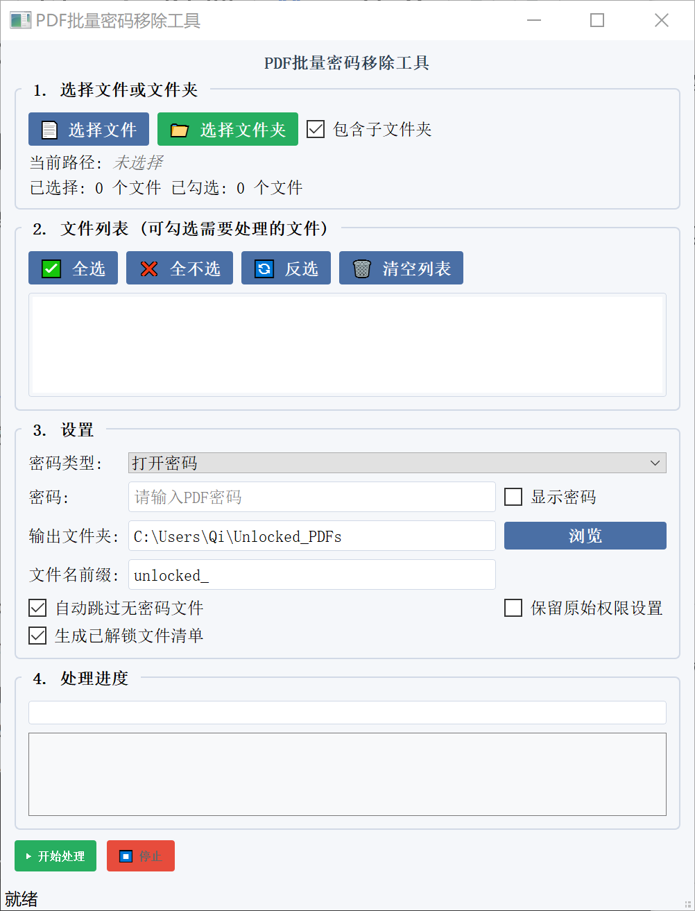

# 批量移除PDF打开密码和只读密码工具

> 基于 pikepdf 开发的跨平台桌面应用，支持批量移除PDF文件的打开密码和权限密码

## 📋 项目简介

本项目为 [pikepdf/pikepdf](https://github.com/pikepdf/pikepdf) 项目开发了一个图形用户界面(GUI)，基于 PyQt5 构建。支持批量处理加密的PDF文件，移除打开密码和只读权限密码，并生成详细处理报告。



### ✨ 核心功能

- **批量处理**：同时移除多个PDF文件的密码保护
- **双重密码支持**：支持移除打开密码和权限密码（只读密码锁）
- **智能检测**：自动识别文件加密状态，可跳过无密码文件
- **文件夹扫描**：支持扫描文件夹及子文件夹中的PDF文件
- **选择控制**：可勾选/取消选择单个或多个文件进行处理
- **详细报告**：自动生成处理结果清单文件
- **进度显示**：实时显示处理进度和状态日志

## 🚀 快速开始

### 环境要求

- Python 3.7+
- 支持 Windows、macOS、Linux

### 安装依赖

```bash
pip install PyQt5 pikepdf
```

### 运行程序

```bash
# 克隆项目
git clone https://github.com/qiword/pdf_password_remover.git
cd pdf_password_remover

# 直接运行
python main.py
```

## 📦 项目打包

### 使用 PyInstaller 打包

```bash
# 安装打包工具
pip install pyinstaller

# 打包为单个可执行文件（推荐）
pyinstaller --onefile --windowed --name "pdf_password_remover" main.py

# 打包后文件位置
dist/pdf_password_remover.exe  # Windows
dist/pdf_password_remover      # macOS/Linux
```

### 打包选项说明

| 参数                | 说明                          |
| ------------------- | ----------------------------- |
| `--onefile`       | 打包为单个可执行文件          |
| `--windowed`      | 不显示控制台窗口（仅Windows） |
| `--name`          | 指定输出文件名                |
| `--icon=icon.ico` | 添加程序图标                  |
| `--add-data`      | 添加额外数据文件              |

## 🖥️ 使用指南

### 1. 选择文件

- **选择文件**：点击"📄 选择文件"按钮选择单个或多个PDF文件
- **选择文件夹**：点击"📁 选择文件夹"扫描整个文件夹（可选包含子文件夹）
- **文件列表**：在列表中勾选需要处理的文件，支持全选/反选

### 2. 设置参数

- **密码类型**：选择"打开密码"、"权限密码"或"两种都尝试"
- **输入密码**：输入已知的PDF密码
- **输出设置**：
  - 输出文件夹：默认为选中文件夹下的"Unlocked_PDFs"
  - 文件名前缀：默认为"unlocked_"
- **处理选项**：
  - 自动跳过无密码文件
  - 保留原始权限设置
  - 生成已解锁文件清单

### 3. 开始处理

- 点击"▶️ 开始处理"按钮启动批量处理
- 实时查看进度条和日志信息
- 处理完成后在输出目录查看解密文件和处理报告

## 📁 项目结构

```
pdf_password_remover/
├── main.py                    # 程序主入口
├── gui/                       # 图形界面模块
│   ├── __init__.py
│   ├── widgets.py            # 自定义控件（如带复选框的列表）
│   └── main_window.py        # 主窗口界面
├── core/                      # 核心功能模块
│   ├── __init__.py
│   └── pdf_worker.py         # PDF处理工作线程
├── utils/                     # 工具模块
│   ├── __init__.py
│   ├── file_utils.py         # 文件操作工具
│   └── string_utils.py       # 字符串处理工具
├── requirements.txt          # 依赖包列表
├── README.md                # 项目说明文档
└── LICENSE                  # 开源许可证
```

## 🛠️ 技术栈

- **PyQt5**：图形用户界面框架
- **pikepdf**：PDF文件处理库
- **Python标准库**：os, sys, shutil, pathlib 等

## ⚙️ 配置说明

### 输出目录设置

- 默认输出目录：用户主目录下的"Unlocked_PDFs"文件夹
- 选择文件夹时自动设置为：`<选中文件夹>/Unlocked_PDFs/`

### 文件名规则

- 解密后的文件名格式：`unlocked_<原文件名>.pdf`
- 可自定义前缀（如：`decrypted_`、`processed_`等）

## 📄 输出文件说明

### 解密后的PDF文件

- 移除所有密码保护
- 保留原始文件内容和格式
- 文件名添加指定前缀

### 处理报告文件

位置：`输出目录/已解锁文件清单.txt`
包含：

- 处理统计信息（成功/失败/跳过数量）
- 每个文件的详细处理结果
- 文件大小和处理时间
- 失败文件列表及原因

## 📄 许可证

本项目采用 MIT 许可证 - 查看 [LICENSE](LICENSE) 文件了解详情。

## 🙏 致谢

- 感谢 [pikepdf/pikepdf](https://github.com/pikepdf/pikepdf) 提供的PDF读写功能
- 感谢所有贡献者和用户的支持

---

**⚠️ 免责声明**：本工具仅用于移除您拥有合法访问权限的PDF文件的密码保护。请遵守相关法律法规，勿用于非法用途。
